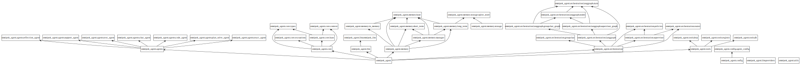
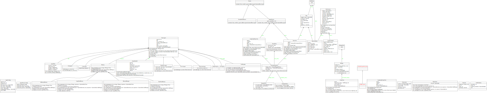

# OmniPok Agent Framework

A flexible and extensible multi-agent framework built with Python and FastAPI.

## Features

- **Multi-Agent Support**: Create and manage multiple specialized agents
- **Tool System**: Extensible tool registry with permission-based access control
- **Memory Management**: Pluggable memory backends (in-memory, Redis, vector stores)
- **Orchestration**: Supervisor pattern for task routing and coordination
- **Group Chat**: Multi-agent collaboration and conversation
- **REST API**: FastAPI-based RESTful API for agent interactions
- **Web UI**: Chainlit interface for interactive agent chat with multimodal support
- **Context Management**: Run context with budget, timeout, and step limits

## Project Structure

```
src/
├─ app/                         # FastAPI/Chainlit入口
│  ├─ api/                      # FastAPI routes
│  ├─ ui/                       # UI interfaces
│  │  ├─ chainlit_app.py        # Chainlit UI
│  │  └─ chainlit_main.py       # Chainlit entry point
│  ├─ config/                   # Configuration management
│  │  └─ agent_config.py        # Agent configuration
│  └─ services/                 # Service layer
│     └─ agent_service.py       # Agent service (singleton)
│  └─ main.py                   # FastAPI app entry
├─ agent/
│  ├─ core/                     # 核心抽象和接口
│  │  ├─ base.py                # BaseAgent 抽象类
│  │  ├─ context.py             # RunContext
│  │  ├─ types.py               # 类型定义
│  │  ├─ tool_registry.py       # 工具注册系统
│  │  └─ memory.py              # 内存接口
│  ├─ tools/                     # 工具实现
│  │  ├─ http.py                # HTTP 工具
│  │  └─ db.py                  # 数据库工具
│  ├─ agents/                    # Agent 实现
│  │  ├─ base_agent_impl.py     # 基础实现
│  │  └─ support_agent.py       # 支持 Agent
│  └─ orchestration/            # 编排系统
│     ├─ router.py              # 任务路由
│     ├─ supervisor.py          # Supervisor
│     ├─ groupchat.py           # 群聊
│     └─ policies.py            # 策略
├─ llm/                         # LLM 集成
├─ observability/               # 可观测性
└─ common/                      # 通用工具
```




## Todo:
[] 重新定义 Agent
[] 任务编排


## Installation

```bash
pip install -r requirements.txt
```

## Quick Start

### 1. Basic Usage

```python
from src.agent.core import RunContext, InMemoryMemory, global_registry, OmniPokLLM, BaseAgent
from src.agent.tools import http_get

# Register a tool
global_registry.register(
    name="http_get",
    description="Make an HTTP GET request",
    func=http_get
)

# Create LLM instance - framework auto-detects provider
llm = OmniPokLLM()

# Or manually specify provider (optional)
# llm = OmniPokLLM(provider="openai", model="gpt-4")
# llm = OmniPokLLM(provider="modelscope", model="qwen/Qwen2.5-7B-Instruct")

# Create an agent
memory = InMemoryMemory()
agent = BaseAgent(
    agent_id="agent-1",
    name="AI助手",
    llm=llm,
    system_prompt="你是一个有用的AI助手",
    memory=memory,
    tool_registry=global_registry
)

# Create context
context = RunContext(
    tenant_id="tenant-1",
    user_id="user-1",
    budget=10.0,
    max_steps=10
)

# Process a message
response = await agent.process("Hello, world!", context)
print(response)
```

### 2. Using Supervisor

```python
from src.agent.orchestration import Supervisor, SimpleRouter
from src.agent.core import RunContext, Task

# Create supervisor
supervisor = Supervisor(
    agents=[agent1, agent2, agent3],
    router=SimpleRouter()
)

# Create and assign a task
task = Task(id="task-1", description="Process this task")
context = RunContext(tenant_id="t1", user_id="u1")
agent_id = await supervisor.assign_task(task, context)
```

### 3. Running the API

```bash
uvicorn src.app.main:app --reload
```

Then visit `http://localhost:8000/docs` for API documentation.

### 4. Agent Configuration

The agent service uses a centralized configuration system. You can configure agents via:

**Option 1: Environment Variables**
```bash
export OPENAI_API_KEY="your-api-key"
export DEFAULT_LLM_MODEL="gpt-4"
export AGENTS_CONFIG='[{"agent_type":"TextAgent","agent_id":"text-agent-1","name":"Text Agent","enabled":true}]'
```

**Option 2: Configuration File (recommended)**
Create `config/agents.json` (see `config/agents.json.example` for template):
```json
{
  "defaults": {
    "llm_provider": "openai",
    "llm_model": "gpt-4",
    "llm_api_key_env": "OPENAI_API_KEY"
  },
  "agents": [
    {
      "agent_type": "TextAgent",
      "agent_id": "text-agent-1",
      "name": "Text Agent",
      "enabled": true
    },
    {
      "agent_type": "CodeAgent",
      "agent_id": "code-agent-1",
      "programming_language": "python",
      "enabled": true
    }
  ]
}
```

The service automatically loads configuration on startup. The FastAPI backend and Chainlit UI share the same agent service instance (singleton pattern).

### 5. Running Chainlit UI

**Option 1: Using the convenience script (recommended)**
```bash
python run_chainlit.py
```

**Option 2: Using chainlit directly**
```bash
# From project root
chainlit run src/app/ui/chainlit_main.py
```

**Option 3: Using python module**
```bash
# From project root
python -m chainlit run src/app/ui/chainlit_main.py
```

Then visit `http://localhost:8000` (default Chainlit port).

## API Endpoints

- `POST /api/v1/chat` - Chat with an agent
- `POST /api/v1/tasks` - Create and assign a task
- `GET /api/v1/tasks/{task_id}` - Get task status
- `GET /api/v1/agents` - List all agents

## UI Features

### Chainlit UI
- Interactive chat interface with multimodal support
- Agent selection
- Real-time conversation
- Usage statistics display
- File upload support (images, audio, video)

## Extending the Framework

### Creating a Custom Agent

```python
from src.agent.core import BaseAgent
from src.agent.core.types import Message, ToolCall, Observation
from src.agent.core.context import RunContext

class MyCustomAgent(BaseAgent):
    async def process(self, message: str, context: RunContext) -> str:
        # Your implementation
        return "Response"
    
    async def execute_tool_call(self, tool_call: ToolCall, context: RunContext) -> Observation:
        # Your implementation
        pass
```

### Adding a Tool

```python
from src.agent.tools import global_registry

async def my_tool(param1: str, param2: int) -> dict:
    """Tool description."""
    return {"result": "success"}

global_registry.register(
    name="my_tool",
    description="My custom tool",
    func=my_tool,
    required_permissions=["permission1"]
)
```

### Custom Memory Backend

```python
from src.agent.core.memory import Memory
from src.agent.core.types import AgentState, Message

class MyMemoryBackend(Memory):
    def save(self, agent_id: str, state: AgentState) -> None:
        # Your implementation
        pass
    
    # Implement other required methods
```

## License

MIT
